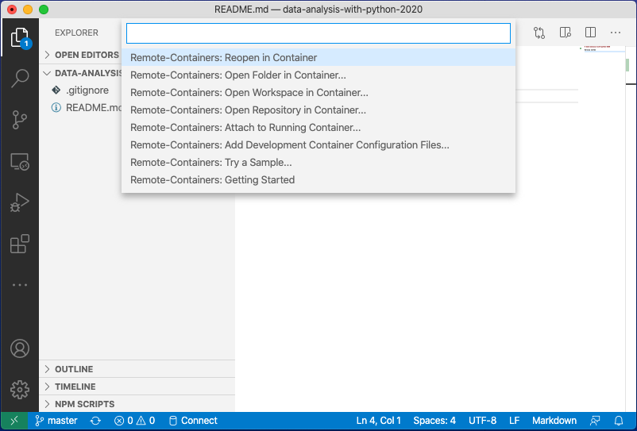
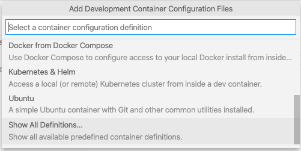
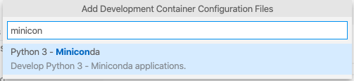

# Data Analysis With Python 2020

VSCode Remote Container with a Miniconda environment for the course [Data analysis with Python - 2020](https://csmastersuh.github.io/data_analysis_with_python_2020/).

## Usage

 1. Have the _Remote - Containers_ extension installed on VSCode
 2. Clone or copy this repository to Your computer
 3. Open the directory in Visual Studio Code
 4. Select _Reopen in Container_ from the Command Palette (this will take a few minutes)

After that the TMC extension should be available in the icons on the left.

## How Was This Made

Created a new repo in GitHub with default `README.md` and `.gitignore` files.

Opened folder in VSCode

Selected _Reopen in Container..._

Selected _Show All Definitions..._

Searched and selected _Python 3 - Miniconda_

This created `.devcontainer` with all related Docker stuff

**Rebuilt** the contained after including the `environment.yml` file.

Then added TMC extension in to the remote container.

